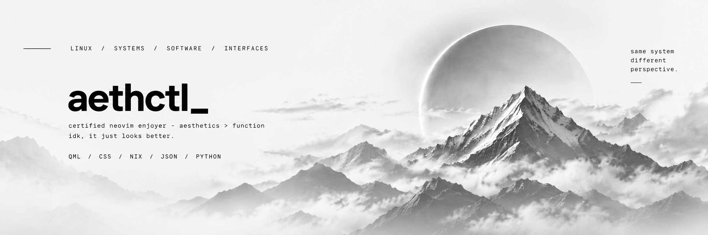
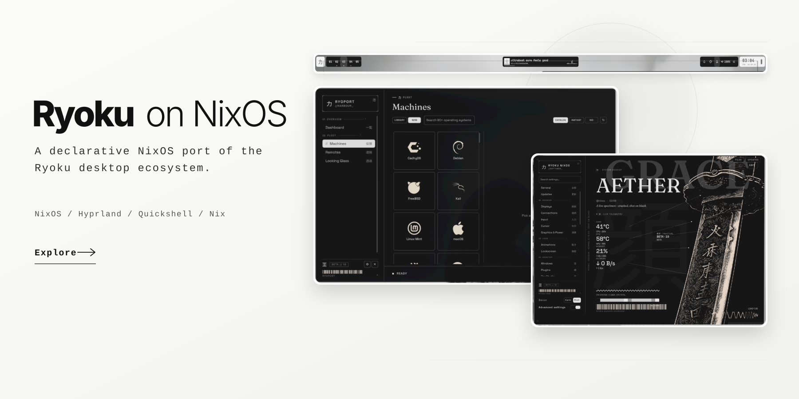

  

linux enthusiast, developer, and serial config-file offender

 

i build software, desktop environments, tooling, and occasionally entire distributions because leaving things stock would be considerably less interesting.

   

   

<code>NixOS</code>
&nbsp;&nbsp;
<code>Hyprland</code>
&nbsp;&nbsp;
<code>Neovim</code>
&nbsp;&nbsp;
<code>zsh</code>

  

currently // building nixview
 
status // probably rewriting something

   

  

<code>[ EOF ]</code>

