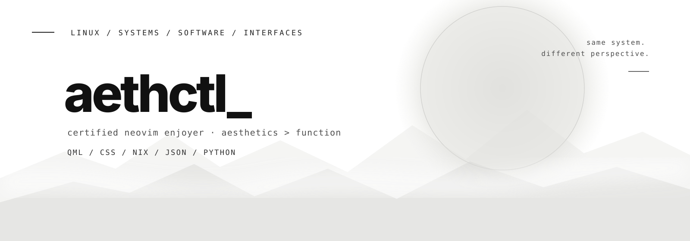
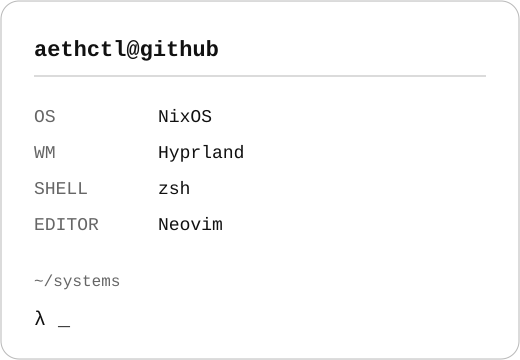
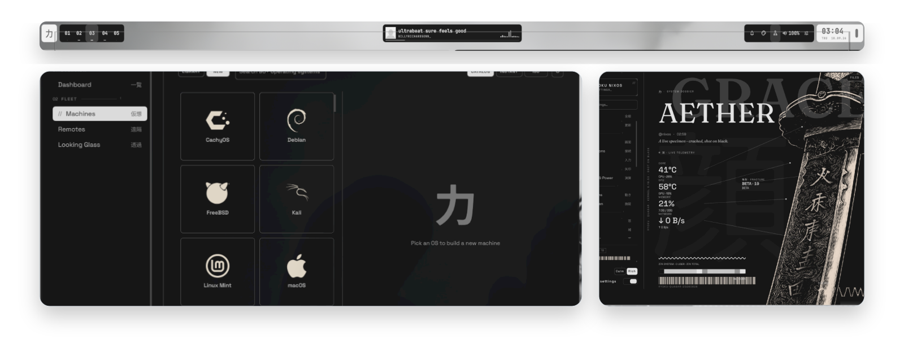

 

### >_ whoami

Linux enthusiast, software developer, and serial config-file offender.

I build Linux tooling, interfaces, and occasionally entire system ports because
leaving things stock is apparently not an option.

- **Systems** — NixOS, Arch, and Void
- **Interfaces** — Hyprland, KDE, and Niri
- **Development** — Nix, Python, QML, Shell, JSON, CSS
- **Editor** — LazyVim obviously

 

### >_ Main Project

**[Ryoku on NixOS](https://github.com/aethctl/Ryoku-on-NixOS)** is an official
NixOS port of the Ryoku desktop ecosystem.

The goal is not to make Ryoku merely *run* on NixOS. It is to make the whole
desktop feel native to it: reproducible packages, declarative configuration,
Nix-managed services, and the same polished Ryoku shell experience.

`NixOS` · `Hyprland` · `Quickshell` · `QML` · `Nix`

### >_ building

**Nixview** &nbsp; `WIP`

See what NixOS is actually doing.

A system inspector for generations, flakes, services, packages, store usage,
dependencies, configuration state, and all the other things NixOS technically
knows but does not always make pleasant to understand.

`NixOS` · `TUI` · `Flakes` · `System Insight`

### >_ selected work

**[CommitQuest](https://github.com/aethctl/commitquest)**  
Turn real Git progress into a local collectathon-style developer RPG.

**[Arcane Guard](https://github.com/aethctl/arcane-guard)**  
Inspect Linux packages, scripts, and dotfiles before trusting them with your system.

**[Ryostore](https://github.com/aethctl/ryostore)**  
Ryoku components, themes, and desktop extras packaged for the ecosystem specifically made for NixOS

### >_ stack

`NixOS` · `Nix` · `QML` · `Quickshell` · `Python` · `Shell` · `JSON` · `CSS`

### >_ currently

building Nixview  
improving Ryoku on NixOS  
changing one line in a config and rebuilding my entire operating system

---

certified neovim enjoyer · aesthetics &gt; function · this is probably why nothing is ever finished

  

<code>[ EOF ]</code>

