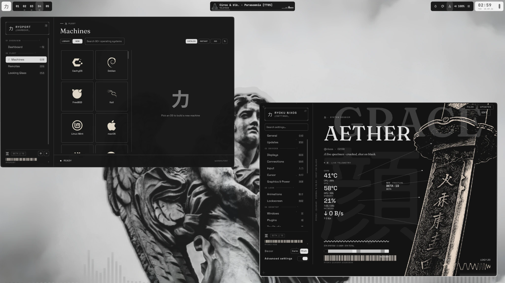
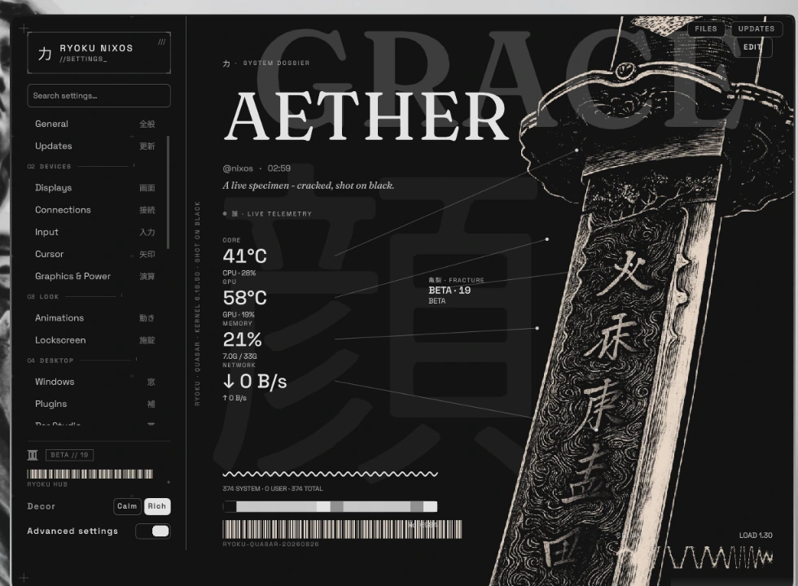

<br/>

### >_ whoami


Linux enthusiast, software developer, and serial config-file offender.

I build Linux tooling, desktop environments, interfaces, and occasionally
entire system ports because leaving things stock is apparently not an option.

Most of my work lives somewhere between **systems engineering**, **desktop UX**,
and **making Linux look considerably better than it has any right to**.

- **Systems** — NixOS, declarative configuration, packaging, services
- **Interfaces** — Hyprland, Quickshell, QML, desktop tooling
- **Development** — Nix, Python, QML, Shell, JSON, CSS
- **Editor** — Neovim, obviously

<br clear="right"/>

### >_ flagship


**[Ryoku on NixOS](https://github.com/aethctl/Ryoku-on-NixOS)** is my declarative
NixOS port of the Ryoku desktop ecosystem.

The goal is not to make Ryoku merely *run* on NixOS. It is to make the whole
desktop feel native to it: reproducible packages, declarative configuration,
Nix-managed services, and the same polished Ryoku shell experience.

`NixOS` · `Hyprland` · `Quickshell` · `QML` · `Nix`


&nbsp;


### >_ building

**Nixview** &nbsp; `WIP`

See what NixOS is actually doing.

A system inspector for generations, flakes, services, packages, store usage,
dependencies, configuration state, and all the other things NixOS technically
knows but does not always make pleasant to understand.

`NixOS` · `TUI` · `Flakes` · `System Insight`

### >_ selected work

**[Ryoku on NixOS](https://github.com/aethctl/Ryoku-on-NixOS)**  
A native declarative port of the Ryoku desktop ecosystem for NixOS.

**Nixview**  
A visual system inspector for understanding a NixOS machine without becoming
one with `nix-store --query`.

**[Ryostore](https://github.com/aethctl/ryostore)**  
Ryoku components, themes and desktop extras packaged for the ecosystem.

### >_ stack

`NixOS` &nbsp;
`Nix` &nbsp;
`QML` &nbsp;
`Quickshell` &nbsp;
`Python` &nbsp;
`Shell` &nbsp;
`JSON` &nbsp;
`CSS`

<br/>

```text
OS       NixOS
WM       Hyprland
SHELL    zsh
EDITOR   Neovim
STATUS   probably rewriting something that already worked
