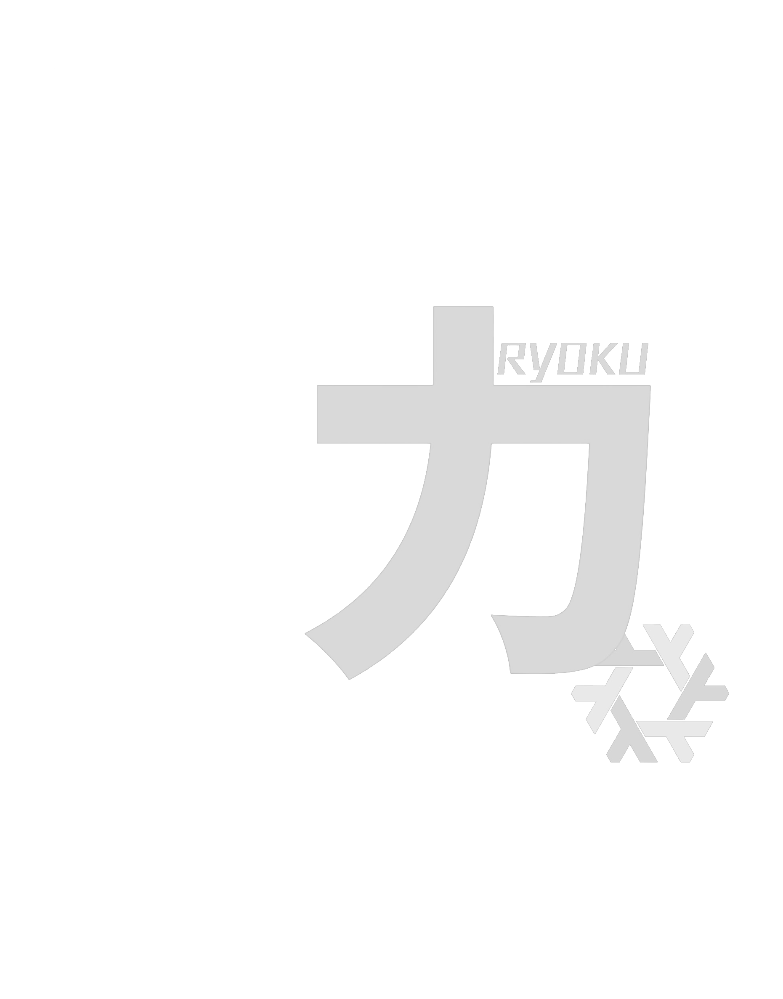

  

<h1 align="center">Hi 👋, I'm Aethctl </h1>

<h3 align="center">Linux Developer</h3>

  

##  <h2 align="center">🚀 About Me </h2>

I spend most of my time building and maintaining Ryoku on NixOS, Creating fastfetch configs, Editing my /etc/nixos/ directory and turning Window Managers into insane masterpieces.

I’m especially interested in Linux systems, Nix, Go, QML, Quickshell, Wayland, desktop environments, system tooling, and UI/UX, with an unhealthy amount of time also dedicated to ricing and making everything feel cohesive.

Right now, my main focus is expanding Ryoku on NixOS into the most complete, polished and unique experience you can get on NixOS and on Linux in general.

My goal is simple: build things I genuinely want to use, keep learning by breaking things in increasingly sophisticated ways, and make Linux desktops feel polished without sacrificing what makes them fun.

<h2 align="center">⛩️ Ryoku</h2>

  <strong>A polished Wayland desktop built around Linux, customization and actual usability.</strong>

  Ryoku is the project I spend most of my time building and contributing to.
  It combines a custom desktop shell, system tooling, theming, applications,
  and compositor integration into one cohesive Linux environment.

  My work around Ryoku focuses heavily on NixOS support, 
  desktop tooling, compositor support and making the whole thing feel just
  as good as it does on Arch Linux and CachyOS.

  <code>NixOS</code>
  &nbsp;•&nbsp;
  <code>Hyprland</code>
  &nbsp;•&nbsp;
  <code>niri</code>
  &nbsp;•&nbsp;
  <code>Quickshell</code>

 

<h2 align="center">✨ Specs</h2>

**OS:** NixOS 26.11 (Zokor)
 
**KER:** 7.2.8-cachy
 
**CPU:** AMD Ryzen 5 5600X @ 4.70 GHz
 
**GPU:** NVIDIA GeForce RTX 5060 8gb @ 2280MHz
 
**MEM:** 32gb DDR4 @ 3600MHz
 
**WM:** niri 26.04
 
**SHELL** Ryoku on NixOS
 

  
  &nbsp;
  

 

<h2 align="center">🤝 Connect</h2>

  
  &nbsp;&nbsp;&nbsp;
  
  &nbsp;&nbsp;&nbsp;
  
  &nbsp;&nbsp;&nbsp;
  

  
    GitHub: <strong>aethctl</strong>
    &nbsp;•&nbsp;
    X: <strong>@aethctl</strong>
    &nbsp;•&nbsp;
    Discord: <strong>aethctl.</strong>
    &nbsp;•&nbsp;
    Steam: <strong>aethctl</strong>
  

<h2 align="center">💻 Tech Stack</h2>

  
  &nbsp;&nbsp;&nbsp;
  
  &nbsp;&nbsp;&nbsp;
  
  &nbsp;&nbsp;&nbsp;
  
  &nbsp;&nbsp;&nbsp;
  
  &nbsp;&nbsp;&nbsp;
  

  
  &nbsp;&nbsp;&nbsp;
  
  &nbsp;&nbsp;&nbsp;
  
  &nbsp;&nbsp;&nbsp;
  
  &nbsp;&nbsp;&nbsp;
  
  &nbsp;&nbsp;&nbsp;
  
  &nbsp;&nbsp;&nbsp;
  

<h2 align="center">⌘ Commit Activity</h2>

  <picture>
    <source
      media="(prefers-color-scheme: dark)"
      srcset="https://raw.githubusercontent.com/aethctl/aethctl./output/pacman-contribution-graph-dark.svg"
    />
    <source
      media="(prefers-color-scheme: light)"
      srcset="https://raw.githubusercontent.com/aethctl/aethctl./output/pacman-contribution-graph.svg"
    />
    
  </picture>

