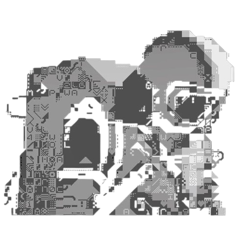

  

<h1 align="center">Hey 👋, I'm Aether</h1>
<h3 align="center">Linux developer · NixOS enthusiast · Ryoku contributor</h3>

  

  
  
  

<h2 align="center">About me</h2>

I spend most of my time building and maintaining **Ryoku on NixOS**, contributing fixes and features across the wider Ryoku ecosystem, and turning Linux desktops into things that feel deliberate rather than assembled from unrelated config files.

I'm especially interested in **NixOS, Go, QML, Quickshell, Wayland, compositor integration, system tooling and UI/UX**. I like software that is technically clean, visually cohesive and actually pleasant to use.

Right now my main focus is pushing Ryoku on NixOS toward a complete, deeply customisable desktop experience while keeping the Nix side reproducible, maintainable and easy to recover.

 

---

<h2 align="center">⛩️ Ryoku on NixOS</h2>

  <strong>The Ryoku you already know, made declarative for NixOS.</strong>

  

Ryoku is more than a shell. It combines a custom desktop shell, theming, system tooling, applications, compositor integration and a growing ecosystem into one cohesive environment.

My work focuses on bringing that experience to NixOS without throwing away what makes NixOS useful in the first place: **declarative configuration, generations, rollback and reproducible system integration**.

  <code>NixOS</code>
  &nbsp;•&nbsp;
  <code>Hyprland</code>
  &nbsp;•&nbsp;
  <code>Niri</code>
  &nbsp;•&nbsp;
  <code>Quickshell</code>
  &nbsp;•&nbsp;
  <code>QML</code>
  &nbsp;•&nbsp;
  <code>Go</code>

  <a href="https://github.com/aethctl/Ryoku-on-NixOS"><strong>Repository</strong></a>
  &nbsp;·&nbsp;
  <a href="https://aethctl.github.io/Ryoku-on-NixOS/"><strong>Website</strong></a>
  &nbsp;·&nbsp;
  <a href="https://discord.gg/8KjBmUEyKA"><strong>Discord</strong></a>
  &nbsp;·&nbsp;
  <a href="https://github.com/Ryoku-dev/ryoku"><strong>Upstream Ryoku</strong></a>

---

<h2 align="center">What I'm building</h2>

<table>
  <tr>
    <td width="50%" valign="top">
      <h3><a href="https://github.com/aethctl/Ryoku-on-NixOS">Ryoku on NixOS</a></h3>
      Maintained NixOS port of the Ryoku desktop, with native packaging, modules, installer integration and NixOS-specific runtime bridges.
    </td>
    <td width="50%" valign="top">
      <h3><a href="https://github.com/aethctl/why">why</a></h3>
      A Linux diagnostics CLI that answers questions like <code>why git</code>, <code>why :8080</code> and <code>why 4312</code> using evidence from the system.
    </td>
  </tr>
  <tr>
    <td width="50%" valign="top">
      <h3><a href="https://github.com/Ryoku-dev/ryoku">Ryoku</a></h3>
      Upstream desktop work across shell behaviour, compositor support, performance, tooling and the wider Ryoku ecosystem.
    </td>
    <td width="50%" valign="top">
      <h3><a href="https://github.com/aethctl/ryomanager">RyoManager</a></h3>
      A Ryoku-native system task manager built around the same visual and interaction language as the rest of the desktop.
    </td>
  </tr>
</table>

---

<h2 align="center">Tech I keep breaking responsibly</h2>

  
  &nbsp;&nbsp;
  
  &nbsp;&nbsp;
  
  &nbsp;&nbsp;
  
  &nbsp;&nbsp;
  
  &nbsp;&nbsp;
  
  &nbsp;&nbsp;
  
  &nbsp;&nbsp;
  

  
<strong>My current setup</strong>

   

**OS:** NixOS 26.11 (Zokor) 
**Kernel:** 7.2.8-cachy 
**CPU:** AMD Ryzen 5 5600X 
**GPU:** NVIDIA GeForce RTX 5060 8GB 
**Memory:** 32GB 
**WM:** Niri 
**Desktop:** Ryoku on NixOS

---

<h2 align="center">Connect</h2>

  
  &nbsp;&nbsp;&nbsp;
  
  &nbsp;&nbsp;&nbsp;
  
  &nbsp;&nbsp;&nbsp;
  

  
    GitHub: <strong>aethctl</strong>
    &nbsp;•&nbsp;
    X: <strong>@aethctl</strong>
    &nbsp;•&nbsp;
    Discord: <strong>Ryoku community</strong>
    &nbsp;•&nbsp;
    Steam: <strong>aethctl</strong>
  

<h2 align="center">⌘ Commit activity</h2>

  <picture>
    <source
      media="(prefers-color-scheme: dark)"
      srcset="https://raw.githubusercontent.com/aethctl/aethctl/output/pacman-contribution-graph-dark.svg"
    />
    <source
      media="(prefers-color-scheme: light)"
      srcset="https://raw.githubusercontent.com/aethctl/aethctl/output/pacman-contribution-graph.svg"
    />
    
  </picture>

